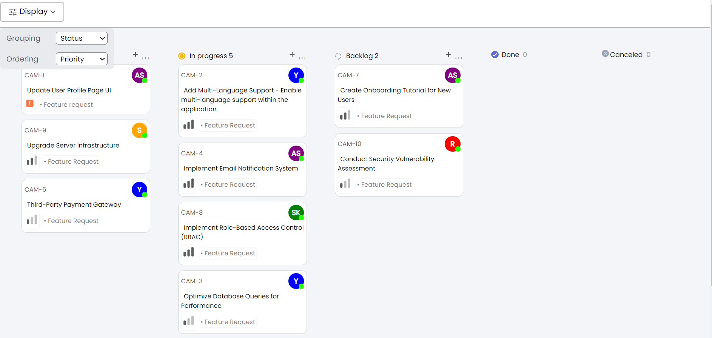
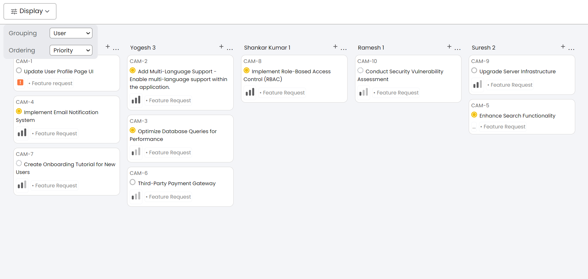
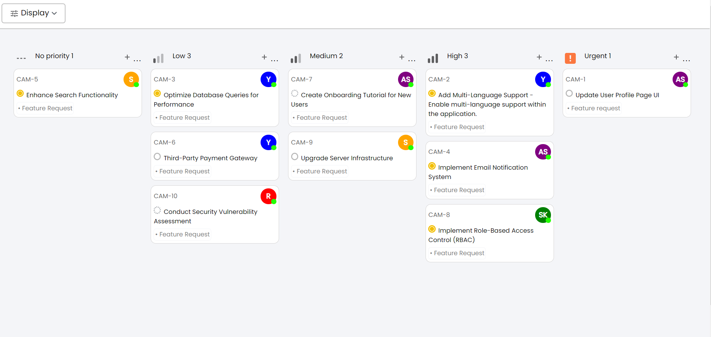
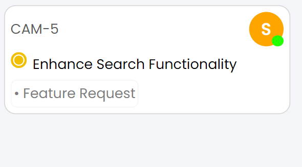

Quicksell Frontend Assignment

Display State:

Group By User:

Group By Priority:

Card:

The application should offer three distinct ways to group the data:

1. **By Status**: Group tickets based on their current status.
2. **By User**: Arrange tickets according to the assigned user.
3. **By Priority**: Group tickets based on their priority level.

Users should also be able to sort the displayed tickets in two ways:

1. **Priority**: Arrange tickets in descending order of priority.
2. **Title**: Sort tickets in ascending order based on their title.

The Kanban board should be responsive and visually appealing, with a design similar to the provided screenshots. 

**The priority levels for the tickets are as follows:**

- Urgent (Priority level 4)
- High (Priority level 3)
- Medium (Priority level 2)
- Low (Priority level 1)
- No priority (Priority level 0)

**Priority levels: (This values you will receive in the api)**

4 - Urgent

3 - High

2 - Medium

1 - Low

0 - No priority